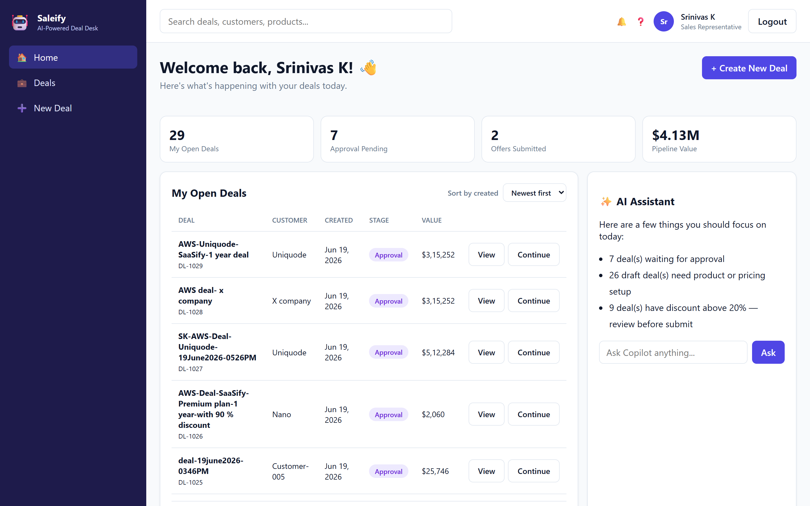
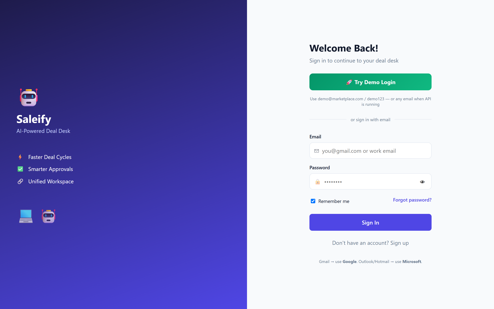
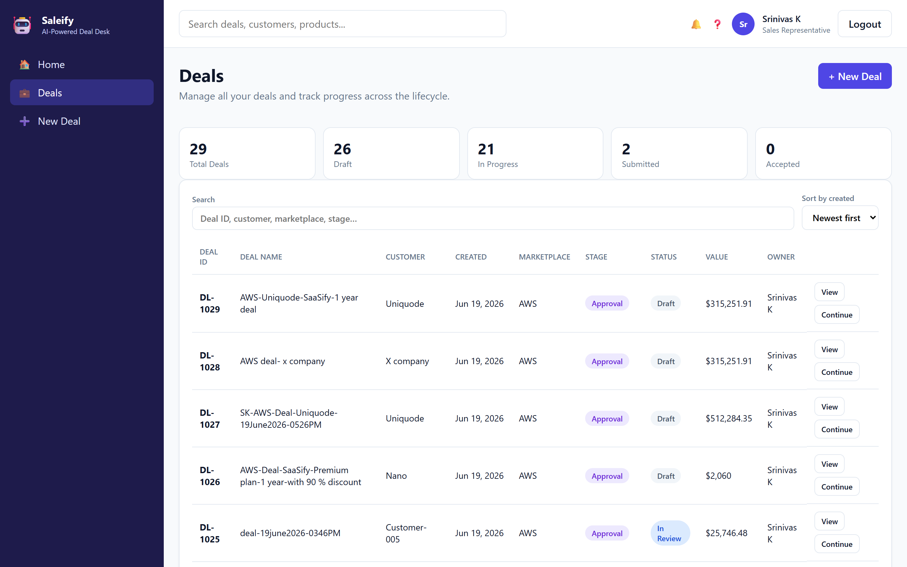
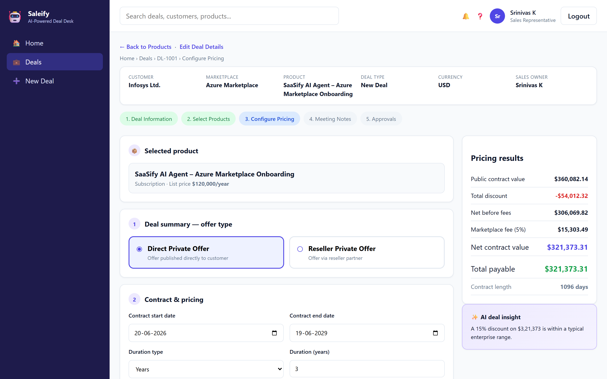
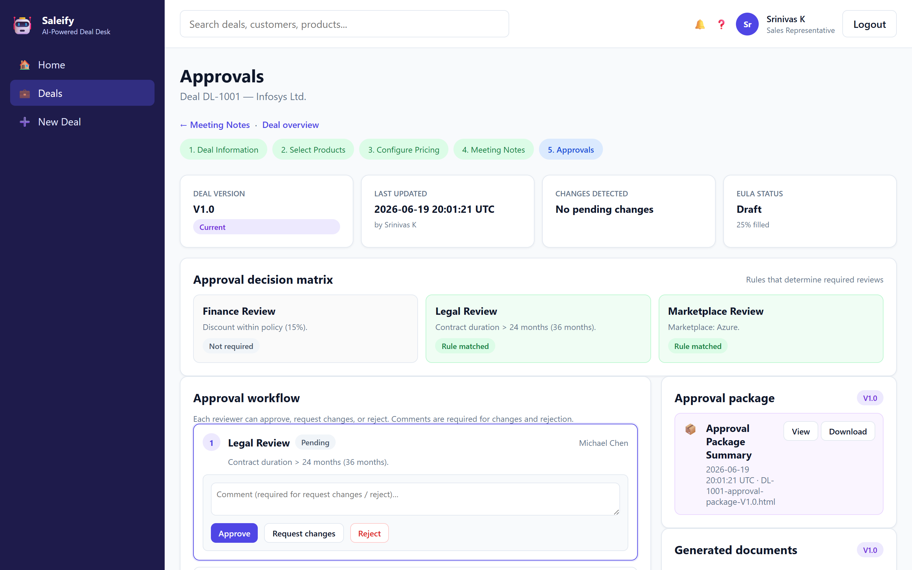
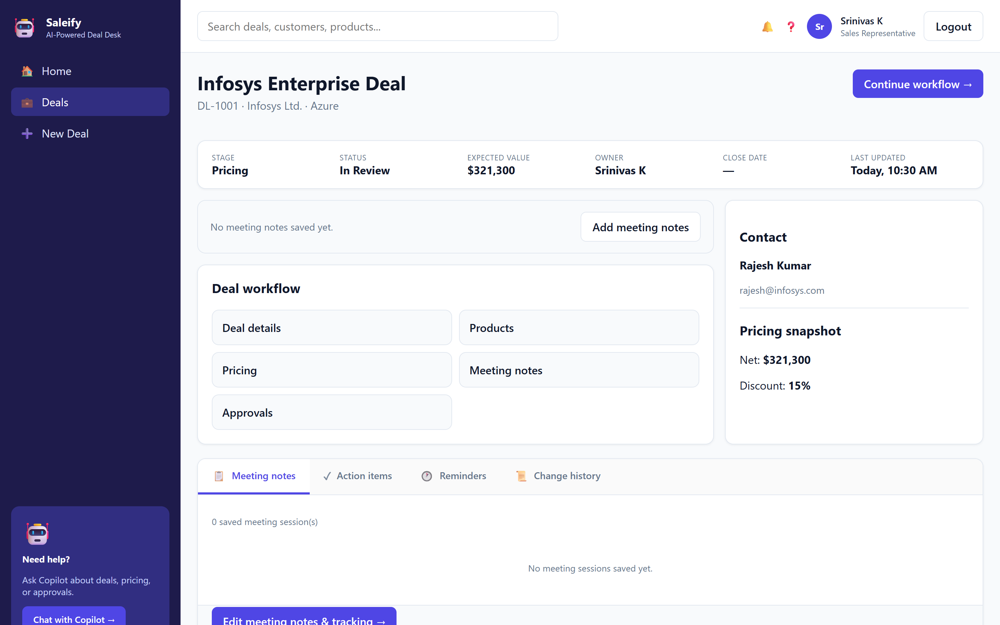
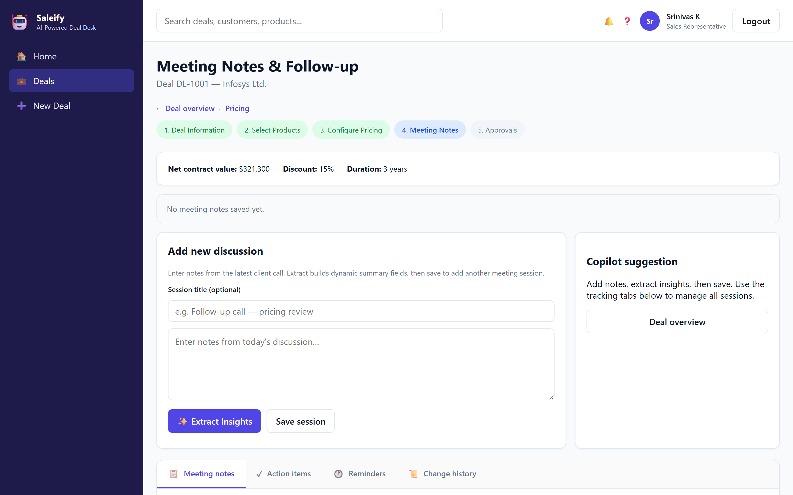

# Saleify

**AI-powered deal desk for cloud marketplace sellers.** Guide a deal from creation through product selection, pricing, meeting-note capture, and multi-step approvals — with rule-based AI assistance throughout. Built as a layered .NET 9 solution with an Angular frontend.

> 🎯 Full demo walkthrough (feature tour, script for judges, troubleshooting): **[HACKATHON-DEMO.md](./HACKATHON-DEMO.md)**
> 🔐 Google / Microsoft sign-in setup: **[AUTH_SETUP.md](./AUTH_SETUP.md)**



---

## Quick start

```powershell
.\start-demo.ps1
```

Open **http://localhost:4200** → click **Try Demo Login** (`demo@marketplace.com` / `demo123`).

The script launches the API (`:5280`) and the Angular dev server (`:4200`) in separate windows.

---

## Features

| Area | What it does |
|------|--------------|
| **Auth** | Demo login, email/password signup flow, Google & Microsoft OAuth (stubs until credentials added) |
| **Home dashboard** | KPIs, open-deal list, tasks, reminders, AI recommendations, copilot chat |
| **Deals list** | Search, created-date sorting, pagination |
| **Deal workflow** | Create → select products → configure pricing → capture meeting notes → approvals |
| **Pricing calculator** | Duration models, per-year discounts, flexible payment schedules, pro-rate, marketplace fees, live preview |
| **Meeting notes + AI** | Extracts standard & dynamic fields and suggests dated action items from raw notes |
| **Approvals** | Rule-driven approval steps (finance / legal / marketplace), document generation (pricing, legal, EULA), audit log, re-approval on change |
| **Change history** | Every deal mutation logged with category, summary, and timestamp |

All AI is **rule-based and offline** — no external API key required for the demo.

---

## Screenshots

| Sign in | Deals |
|---------|-------|
|  |  |

| Pricing calculator | Approvals |
|--------------------|-----------|
|  |  |

| Deal overview | Meeting notes + AI |
|---------------|--------------------|
|  |  |

---

## Architecture

The backend mirrors a classic enterprise layering (modeled on the SaaSify reference solution): each layer is its own project, and services are registered and injected **against their contracts**.

```
                         ┌─────────────────────────────┐
  HTTP / Angular  ─────► │   MarketplaceCopilot.Api     │  Controllers, Program.cs, DI
                         └──────────────┬──────────────┘
                                        │ depends on
                ┌───────────────────────┼───────────────────────┐
                ▼                       ▼                        ▼
   MarketplaceCopilot.Services   .Services.Contracts     MarketplaceCopilot.Data
   (DealService, AiService,      (IDealService, …          (DataStore, UserStore —
    PricingService, Approval…)    interfaces)               JSON / in-memory)
                │                                               │
                └───────────────────┬───────────────────────────┘
                                    ▼
                       MarketplaceCopilot.Entities
                       (Models/ + Dtos/ — domain types)

   Generic bases:  Repository.Pattern  (IObjectState, IRepository<T>, UnitOfWork)
                   Service.Pattern     (IService<T>, Service<T>)
```

**Dependency flow:** `Api → Services (+ Contracts) → Data → Entities`, with the generic `Repository.Pattern` / `Service.Pattern` projects underneath.

The Angular app uses a **core / shared / features** layout with TypeScript path aliases:

| Alias | Folder | Holds |
|-------|--------|-------|
| `@core/*` | `src/app/core` | App-wide singletons — `services/`, `guards/` |
| `@shared/*` | `src/app/shared` | Reusable `components/`, `utils/`, `data/` |
| `@features/*` | `src/app/features` | One folder per screen |
| `@layout/*` | `src/app/layout` | App shell |
| `@environments/*` | `src/environments` | Environment config |

---

## Tech stack

- **Backend:** .NET 9 Web API (controllers), layered class-library projects, cookie + OAuth authentication, JSON file persistence
- **Frontend:** Angular (standalone components), TypeScript, SCSS
- **AI:** rule-based extraction/insights (offline); optional OpenAI key supported via config
- **Tooling:** `dotnet` CLI, `npm` / Angular CLI

---

## Getting started

### Prerequisites

- [.NET 9 SDK](https://dotnet.microsoft.com/download)
- [Node.js 18+](https://nodejs.org) and npm

### Build everything

```powershell
dotnet build MarketplaceCopilot.sln       # backend solution
cd frontend && npm install                 # frontend deps (first run)
```

### Run manually

```powershell
# Terminal 1 — backend (or: dotnet run --project MarketplaceCopilot.Api)
cd MarketplaceCopilot.Api && dotnet run

# Terminal 2 — frontend
cd frontend && npm start
```

API → http://localhost:5280 · UI → http://localhost:4200

---

## Project structure

```
Marketplace-Copilot/
├── MarketplaceCopilot.sln
├── MarketplaceCopilot.Api/                  # Presentation: REST controllers + Program.cs
│   └── data/deals.json                      #   demo data (read from host content root)
├── MarketplaceCopilot.Services/             # Business logic (concrete services)
├── MarketplaceCopilot.Services.Contracts/   # Service interfaces
├── MarketplaceCopilot.Data/                 # DataStore (JSON persistence), UserStore
├── MarketplaceCopilot.Entities/             # Models/ + Dtos/
├── Repository.Pattern/                      # Generic repository base
├── Service.Pattern/                         # Generic service base
├── frontend/                                # Angular app (core / shared / features)
├── start-demo.ps1                           # One-click launcher
├── HACKATHON-DEMO.md                        # Full demo guide
└── AUTH_SETUP.md                            # OAuth setup
```

---

## API reference (selected)

Base URL: `http://localhost:5280`

| Method | Endpoint | Purpose |
|--------|----------|---------|
| `GET`  | `/api/health` | Liveness check |
| `GET`  | `/api/dashboard` | KPIs, tasks, reminders, recommendations |
| `GET`  | `/api/deals` · `/api/deals/{id}` | List / fetch deal (with detail) |
| `GET`  | `/api/deals/stats` | Pipeline counts by status |
| `POST` | `/api/deals` · `PUT /api/deals/{id}` | Create / update deal |
| `POST` | `/api/deals/{id}/products` | Set selected products |
| `POST` | `/api/deals/{id}/pricing/preview` · `/pricing` | Calculate / save pricing |
| `POST` | `/api/deals/{id}/meeting-notes` | Save notes + AI insight |
| `GET`  | `/api/deals/{id}/approvals` | Approval summary + documents |
| `POST` | `/api/deals/{id}/approvals/action` | Approve / reject / request changes |
| `GET`  | `/api/deals/{id}/approvals/documents/{docId}` | Render generated document |
| `POST` | `/api/ai/extract-insights` · `/api/ai/chat` | AI extraction / copilot chat |
| `GET`  | `/api/products` · `/api/lookups` | Catalog & dropdown lookups |

---

## Configuration

- **Demo login:** `demo@marketplace.com` / `demo123` (seeded on startup)
- **OAuth (Google / Microsoft):** add credentials to `MarketplaceCopilot.Api/appsettings.json` — see [AUTH_SETUP.md](./AUTH_SETUP.md)
- **AI provider:** defaults to the built-in rule engine; set `Ai:OpenAiApiKey` in `appsettings.json` to use OpenAI
- **Data:** seed/demo deals live in `MarketplaceCopilot.Api/data/deals.json` and persist there at runtime — no database setup required

---

## Notes

- This is a hackathon-grade demo: persistence is a JSON file, AI is rule-based, and auto-approval is enabled in Development. Harden these (real DB, secrets management, restricted approval) before any production use.
- Build the whole backend with `dotnet build` at the repo root; the `MarketplaceCopilot.Api` project is the runnable host.
